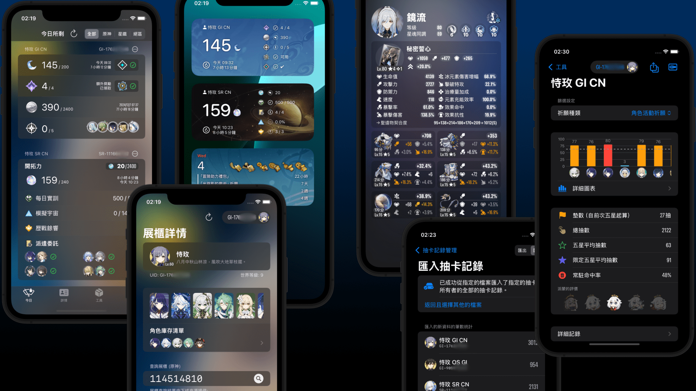

# 披萨小助手（由统一披萨引擎驱动）



这是 **披萨小助手** 的新仓库（从版本 5 开始）。

* 它从之前的 `原神披萨小助手 (v1 ~ v4)` 重新命名。
* 它包含了 `星铁道披萨小助手` 提供的所有功能、还新增了星穹车票帐簿与混沌回忆个人战报的功能。
* 该仓库还维护统一披萨引擎的主代码库。

该项目使用 Swift 6，目标是 iOS 17.4 及更高版本。

> 有关公共文档（例如隐私政策、最终用户许可协议等），请查看此仓库中的 `EndUserPublicDocs` 文件夹。此仓库的 GitHub Wiki 可能在极少数情况下会过时。公共文档仅提供主要语言（英语、简体中文、繁体中文和日语）。

### 关于披萨小助手

* 它最初设计为一个简单的 iOS 小工具（Widgets）应用程序，用于检查原粹树脂和开拓力。
* 后来增加了对 Enka 角色展示和抽卡记录管理的支持。
* 也还新增了对 Apple Watch 的支持。
* 随着时间的推移，米哈游和 HoYoLAB 都增强了他们自己的实用功能。此时，披萨小助手并不意味着完全取代它们，而是让同样的功能更易用。
* 披萨小助手还允许用户管理他们的抽卡记录。数据存储在用户设备本地和他们的私人 iCloud 中。

### 支持的游戏

* 原神（完全支持）
* 崩坏：星穹铁道（完全支持）
* 绝区零（仅每日便笺）

> 由于各种原因，本仓库目前不计划在未来一年内提供对绝区零（Zenless Zone Zero）的进阶支持。目前，该应用程序仅计划在小工具、实时活动和今日标签中支持绝区零每日便笺。

### 支持的系统

实际需求：Apple OS24 系列（iOS 17, macOS 14, watchOS 10)。

该专案或可建置给更早的 iOS 系统，但那只是为了让老系统的用户们导出资料而设计的、并不会对老系统提供本软件的任何其他功能。

### 安装和发布说明

有关安装披萨小助手的信息，请参阅 [官方 iOS / macOS App Store 产品页面](https://apps.apple.com/app/id1635319193)。

**关于 Android 开发的说明：**

我们目前**不**开发 Android 版披萨小助手。此决定是由于技术挑战以及管理 Android 平台上潜在的假冒应用程序的困难。假冒应用程序可能有害，请务必小心。

### 许可证

所有 Swift 程序文件（不包括用于解码和编码外部数据的数据结构）均根据以下许可证发布：

```
// (c) 2024 及以后 披萨工作室 (AGPL v3.0 许可证或更高版本)。
// ====================
// 此代码根据 SPDX-License-Identifier: `AGPL-3.0-or-later` 发布。
```

### 鸣谢

**主要开发者（当前维护者）：**

* Shiki Suen: 统一披萨引擎的主要架构师；Enka 展柜支持等。

**主要开发者（已卸任开发维护之工作）：**

* Lava (CanglongCL): 项目创始人；主要开发者（尤其是小工具）（2024年10月01日卸任）。
* Haku Bill: 主要开发者（2024年05月20日卸任）。

此仓库不包括其前身（即《原神披萨小助手》 v1~v4 和《星铁披萨小助手》）的开发历史。以下是参考链接：

* https://github.com/pizza-studio/GenshinPizzaHelper
* https://github.com/pizza-studio/HSRPizzaHelper

$ EOF
